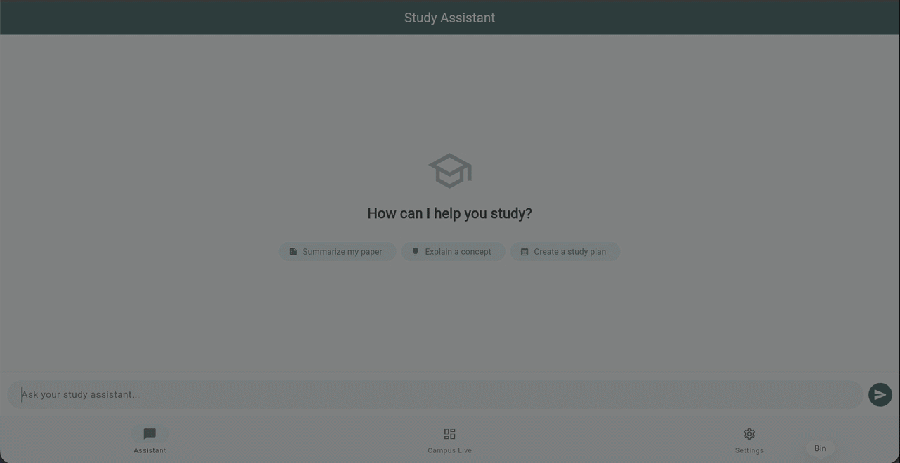

# Exeter Academic Agent

[](https://github.com/sandycompetent/exeter_academic_agent/actions/workflows/deploy.yml)
[](https://flutter.dev)
[](https://ai.google.dev/)
[](https://opensource.org/licenses/MIT)
[](https://sandycompetent.github.io/exeter_academic_agent/)

<p align="center">
  
</p>

A high-performance **LLM-Agentic Study Assistant** built with Flutter and Google Gemini. This project showcases modern AI engineering patterns, including real-time stream processing, agentic "thought" orchestration, and multi-model routing for academic workflows at the University of Exeter.

## 🎯 Why I Built This
This project was born out of a desire to move beyond simple "GPT-wrappers" and explore the potential of **Agentic AI** in a specialized, high-stakes environment: Higher Education. 

Students at the University of Exeter face a fragmented data landscape—weather, bus schedules, and academic concepts are spread across different platforms. This assistant was built to:
1. **Consolidate campus-specific data** into a single, intelligent interface.
2. **Implement Production-Grade AI patterns** like streaming and multi-stage thought processes in a cross-platform (Flutter) environment.
3. **Demonstrate Agentic workflows** where the AI doesn't just answer but actively helps the student "think" through their next steps.

## 🔗 Live Demo
Try the agentic experience directly in your browser: [sandycompetent.github.io/exeter_academic_agent/](https://sandycompetent.github.io/exeter_academic_agent/)

## 🧠 ML Engineering & Agentic Features

This isn't just a "wrapper app." It implements several advanced LLM patterns:

- **Agentic Orchestration**: The assistant uses a multi-step "Thinking" phase to determine the best response strategy before execution.
- **Token-by-Token Streaming**: Low-latency UI updates using asynchronous Dart streams for a responsive "real-time" feel.
- **Dynamic Tool Use & Context Injection**: Integrated system instructions that ground the agent in the University of Exeter's academic context.
- **Automated Follow-up Generation**: An secondary "observer" LLM pass (using `gemini-2.5-flash-lite`) to generate contextual suggestions and maintain conversation flow.
- **Model Routing**: Dynamic selection between specialized models (Pro vs Flash) based on task complexity and cost/latency requirements.

## 🚀 Features

### 1. Agentic Study Assistant
- **Thinking State Indicator**: Visualizes the agent's internal state transitions before response delivery.
- **Smart Follow-ups**: Zero-tap deeper exploration via 3 AI-generated relevant questions.
- **Academic Specialist**: System-level prompt engineering for high-quality study plans and summaries.

### 2. Campus Live Dashboard
- **Real-time Environment Data**: Integration with Open-Meteo for hyper-local campus weather.
- **Predictive Transit**: AI-assisted analysis of Stagecoach bus routes (4/4A) to Exeter campus.
- **Library Occupancy Modeling**: Time-aware heuristic estimates for Forum and St Luke's library capacity.

## 🛠 Tech Stack

- **Framework**: [Flutter](https://flutter.dev) (v3.11+)
- **AI Engine**: [Google Gemini SDK](https://pub.dev/packages/google_generative_ai) (v0.4.7)
- **State Management**: [Provider](https://pub.dev/packages/provider) for clean architecture and reactive state.
- **CI/CD**: GitHub Actions for automated Web deployment and Android APK generation.
- **Security**: Secure API key management via `--dart-define` env variables.

## 📦 Installation & Security

### 1. Clone & Setup
```bash
git clone https://github.com/sandycompetent/exeter_academic_agent.git
cd exeter_academic_agent
flutter pub get
```

### 2. Secure API Configuration
This project follows security best practices and **does not hardcode API keys**. You must provide your Google AI Studio key at build time:

**Debug/Run:**
```bash
flutter run --dart-define=API_KEY=your_gemini_api_key_here
```

**Release Build:**
```bash
flutter build apk --release --dart-define=API_KEY=your_gemini_api_key_here
```

*Note: You can also manage your key dynamically within the app's Settings tab, which is persisted locally and never shared.*

## 📂 Project Structure

- `lib/services/`: LLM orchestration and API communication (Gemini, Weather).
- `lib/providers/`: Global state, model configuration, and reactive logic.
- `lib/models/`: Domain-specific data structures.
- `lib/screens/`: High-level feature modules (Chat Agent, Dashboard).

## 🚧 Known Limitations & Future Roadmap
While built with a production-grade architecture, the project has a clear roadmap for future engineering improvements:

- **RAG Integration (Planned)**: Moving from system-prompt grounding to a Vector Database (like local embeddings) to index official Exeter course handbooks and academic policy documents.
- **Deeper API Integration**: Expanding from transit/weather to include real-time library seat availability and personalized timetable syncing.
- **Reflection Loops**: Implementing a "Self-Critique" step in the agentic flow where the model verifies its own output for academic accuracy before streaming.
- **Automated Evals**: Building a test suite for LLM-response evaluation to measure coherence and grounding over time.

## 📄 License

Distributed under the MIT License. See `LICENSE` for more information.
